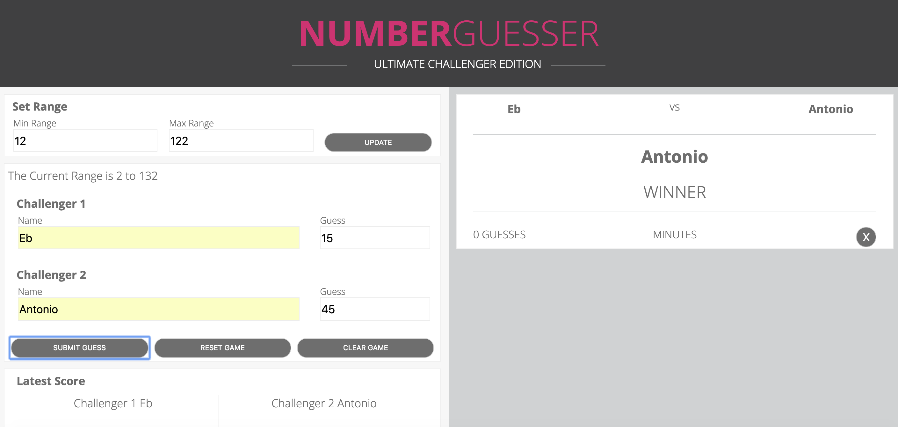
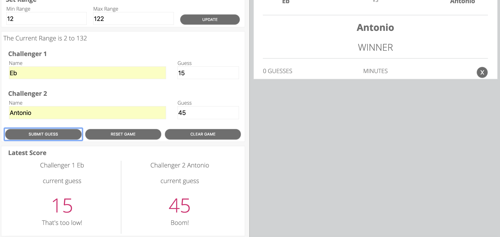
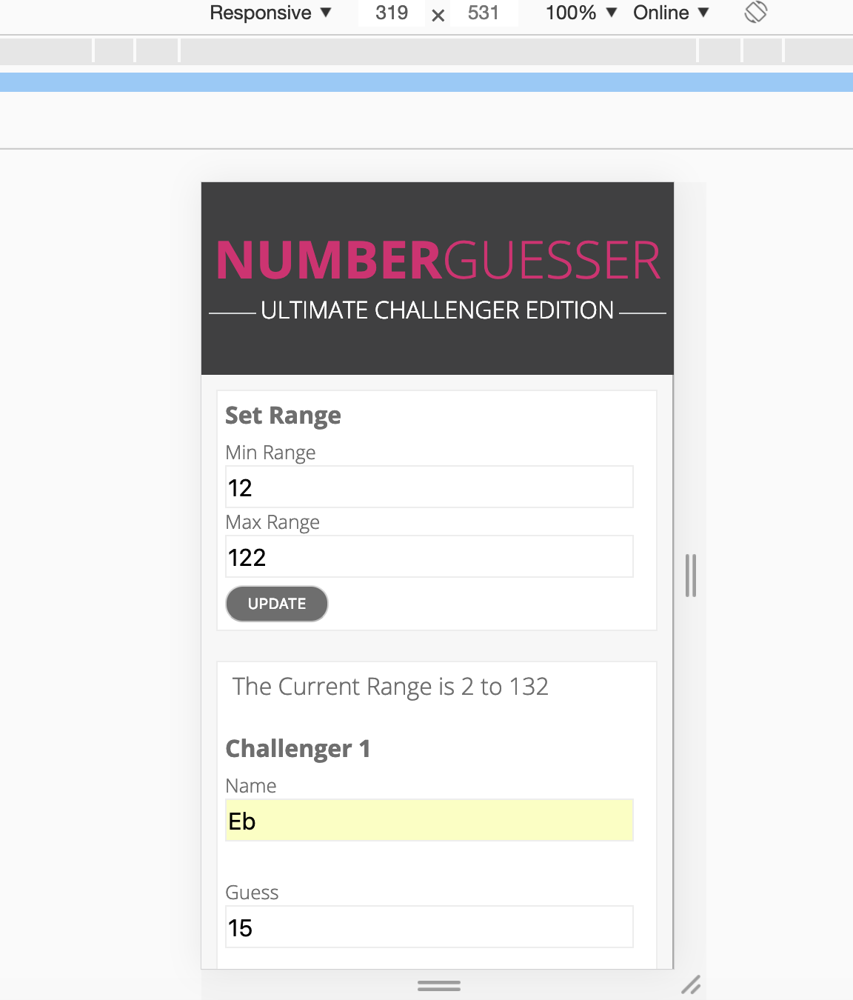
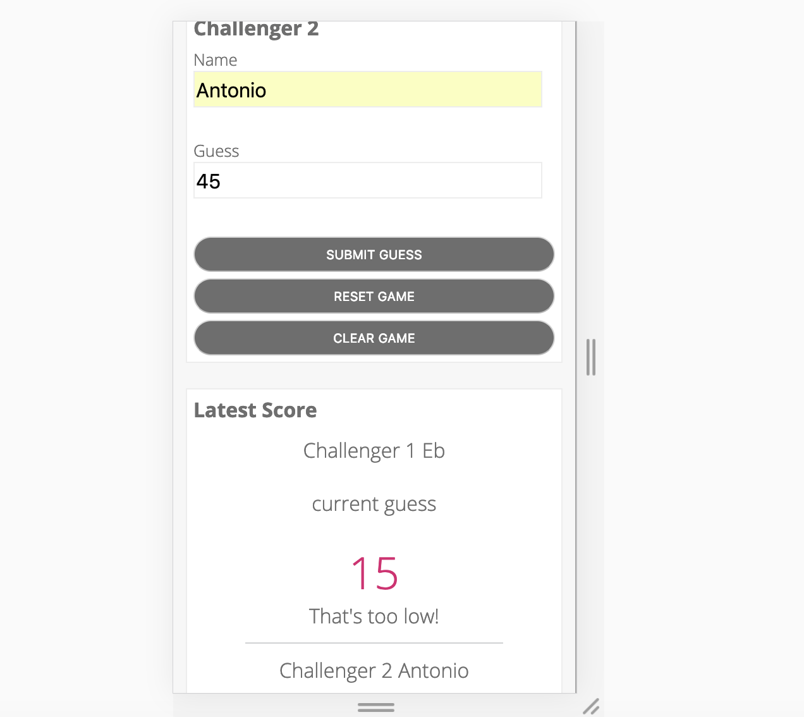
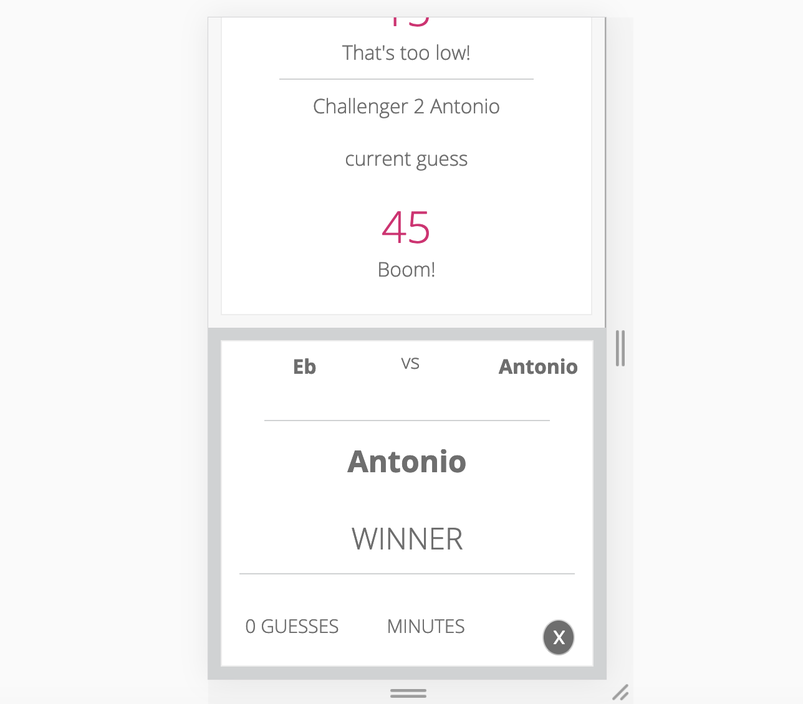

# Number Guesser
### By Antonio Fry and Ebenezer Ingalsbe
## Intro
This project was assigned to give us an opportunity to demonstrate our begginer level Javascript. The sites actual function relies on two users being present, and for the them to set a range between two numbers. Once the numbers have been set, the site will randomly pick a number within that range. From there it is up to the users to compete, and guess the number. After each turn the site will either prompt the user saying their guess 'was too high' or ' too low', or will display the winner on a card on the right. When there is a winner the min range will go down by 10, and the max range will go up by ten. The reset game button will reset the fields and generate a new random number. The clear game button will only reset the guess fields. 

## Learning goals
1. Develop and hone skills with writing semantic html.
2. Develop and hone skills with DRY css and javascript.
3. Use variety of ways to manipulate the DOM (eventListeners, replacing innerText/html).

## Original commp
Even though one of the main focuses of the site was creating functioning Javascript, the css and html was completely based off this comp for the desktop:

This image below was the comp for the mobile version:

## Project screenshots
### Desktop 1

### Desktop 2

### Mobile 1

### Mobile 2

### Mobile 3

